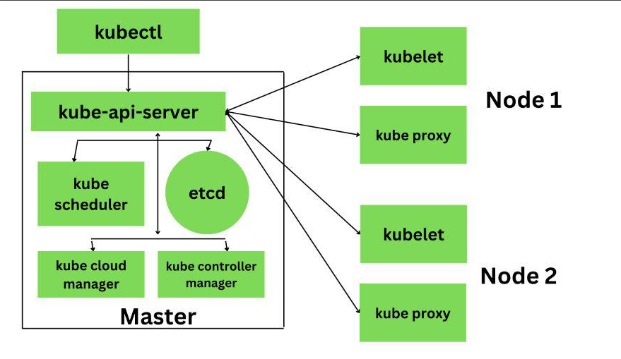
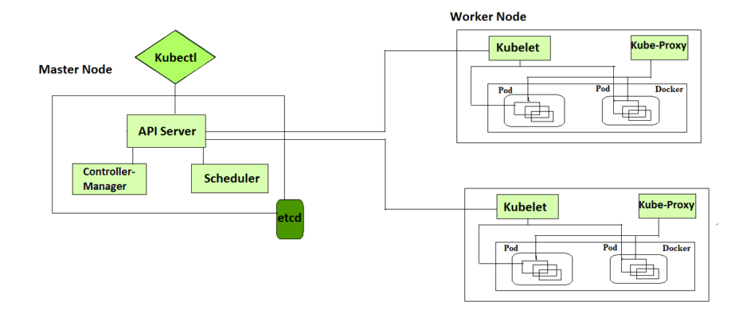

# Architecutre of Kubernetes: 




A Kubernetes cluster consists of control plane nodes and worker nodes.

### **Control Plane**

The control plane is responsible for container orchestration and maintaining the desired state of the cluster. It has the following components.

1.  kube-apiserver
2.  etcd
3.  kube-scheduler
4.  kube-controller-manager
5.  cloud-controller-manager

A cluster can have one or more control plane nodes.

### **Worker Node**

   The Worker nodes are responsible for running containerized applications. The worker Node has the following components.

1.  kubelet
2.  kube-proxy
3.  Container runtime


#### Kubernetes Control Plane Components

First, let’s take a look at each control plane component and the important concepts behind each component.

1. **kube-apiserver**

The kube-api server is the central hub of the Kubernetes cluster that exposes the Kubernetes API. It is highly scalable and can handle large number of concurrent requests.

End users, and other cluster components, talk to the cluster via the API server. Very rarely monitoring systems and third-party services may talk to API servers to interact with the cluster.

The communication between the API server and other components in the cluster happens over TLS to prevent unauthorized access to the cluster.


### **Kubernetes api-server is responsible for the following.**

***API management:*** Exposes the cluster API endpoint and handles all API requests. The API is version and itsupports multiple API versions simultaneously.
Authentication (Using client certificates, bearer tokens, and HTTP Basic Authentication) and Authorization (ABAC and RBAC evaluation)

Processing API requests and validating data for the API objects like pods, services, etc. (Validation and Mutation Admission controllers)
api-server coordinates all the processes between the control plane and worker node components.
API server also contianes an aggreagation layer which allows you to extend Kubernetes API to create custom APIs resources and controllers.

The only component that the kube-apiserver initiates a connection to is the etcd component. All the other components connect to the API server.

The API server also supports watching resources for changes. For example, clients can establish a watch on specific resources and receive real-time notifications when those resources are created, modified, or deleted.

Each component (Kubelet, scheduler, controllers) independently watches the API server to figure out what it needs to do.

api-server has a built-in apiserver proxy. It is part of the API server process. It is primarily used to enable access to ClusterIP services from outside the cluster, even though these services are typically only reachable within the cluster itself.

```
kubectl proxy --port=8080
```

```
kubectl port-forward <pod-name> 8080:80
```

```
kubectl exec -it <pod-name> -- /bin/bash
```

2. **etcd**

Kubernetes is a distributed system and it needs an efficient distributed database like etcd that supports its distributed nature. It acts as both a backend service discovery and a database. You can call it the brain of the Kubernetes cluster.

etcd is an open-source strongly consistent, distributed key-value store. So what does it mean?

Strongly consistent: If an update is made to a node, strong consistency will ensure it gets updated to all the other nodes in the cluster immediately. Also if you look at CAP theorem, achieving 100% availability with strong consistency and & Partition Tolerance is impossible.

Distributed: etcd is designed to run on multiple nodes as a cluster without sacrificing consistency.
Key Value Store: A nonrelational database that stores data as keys and values. It also exposes a key-value API. The datastore is built on top of BboltDB which is a fork of BoltDB.
etcd uses raft consensus algorithm for strong consistency and availability. It works in a leader-member fashion for high availability and to withstand node failures.

#### So how does etcd work with Kubernetes?

To put it simply, when you use kubectl to get kubernetes object details, you are getting it from etcd. Also, when you deploy an object like a pod, an entry gets created in etcd.

In a nutshell, here is what you need to know about etcd.

etcd stores all configurations, states, and metadata of Kubernetes objects (pods, secrets, daemonsets, deployments, configmaps, statefulsets, etc).
etcd allows a client to subscribe to events using Watch() API . Kubernetes api-server uses the etcd’s watch functionality to track the change in the state of an object.
etcd exposes key-value API using gRPC. Also, the gRPC gateway is a RESTful proxy that translates all the HTTP API calls into gRPC messages. This makes it an ideal database for Kubernetes.
etcd stores all objects under the /registry directory key in key-value format. For example, information on a pod named Nginx in the default namespace can be found under /registry/pods/default/nginx


Also, etcd it is the only Statefulset component in the control plane.

The number of nodes in an etcd cluster directly affects its fault tolerance. Here’s how it breaks down:

```
3 nodes: Can tolerate 1 node failure (quorum = 2)
5 nodes: Can tolerate 2 node failures (quorum = 3)
7 nodes: Can tolerate 3 node failures (quorum = 4)
```
And so on. The general formula for the number of node failures a cluster can tolerate is:

```
fault tolerance = (n - 1) / 2
```

3. **kube-scheduler**

The kube-scheduler is responsible for scheduling Kubernetes pods on worker nodes.

When you deploy a pod, you specify the pod requirements such as CPU, memory, affinity, taints or tolerations, priority, persistent volumes (PV),  etc. The scheduler’s primary task is to identify the create request and choose the best node for a pod that satisfies the requirements.

**The following image shows a high-level overview of how the scheduler works.**


In a Kubernetes cluster, there will be more than one worker node. So how does the scheduler select the node out of all worker nodes?

#### Here is how the scheduler works.

To choose the best node, the Kube-scheduler uses filtering and scoring operations.
In filtering, the scheduler finds the best-suited nodes where the pod can be scheduled. For example, if there are five worker nodes with resource availability to run the pod, it selects all five nodes. If there are no nodes, then the pod is unschedulable and moved to the scheduling queue.

If It is a large cluster, let’s say 100 worker nodes, and the scheduler doesn’t iterate over all the nodes. There is a scheduler configuration parameter called percentageOfNodesToScore. The default value is typically 50%. So it tries to iterate over 50% of nodes in a round-robin fashion. If the worker nodes are spread across multiple zones, then the scheduler iterates over nodes in different zones. For very large clusters the default percentageOfNodesToScore is 5%.

In the scoring phase, the scheduler ranks the nodes by assigning a score to the filtered worker nodes. The scheduler makes the scoring by calling multiple scheduling plugins. Finally, the worker node with the highest rank will be selected for scheduling the pod. If all the nodes have the same rank, a node will be selected at random.
Once the node is selected, the scheduler creates a binding event in the API server. Meaning an event to bind a pod and node.





Following is the list of important built-in Kubernetes controllers.

1.  Deployment controller
2.  Replicaset controller
3.  DaemonSet controller 
4.  Job Controller (Kubernetes Jobs)
5.  CronJob Controller
6.  endpoints controller
7.  namespace controller
8.  service accounts controller.
9.  Node controller


Following are the three main controllers that are part of the cloud controller manager.

* **Node controller:** This controller updates node-related information by talking to the cloud provider API. For example, node labeling & annotation, getting hostname, CPU & memory availability, nodes health, etc.
* **Route controller:** It is responsible for configuring networking routes on a cloud platform. So that pods in different nodes can talk to each other.
* **Service controller:** It takes care of deploying load balancers for kubernetes services, assigning IP addresses, etc.

#### Following are some of the classic examples of cloud controller manager.

Deploying Kubernetes Service of type Load balancer. Here Kubernetes provisions a Cloud-specific Loadbalancer and integrates with Kubernetes Service.
Provisioning storage volumes (PV) for pods backed by cloud storage solutions.

## Kubernetes Native Objects:

Till now we have learned about the core kubernetes components and how each component works.

#### All these components work towards managing the following key Kubernetes objects.

1. Pod
2. Namespaces
3. Replicaset
4. Deployment
5. Daemonset
6. Statefulset
7. Jobs & Cronjobs
8. ConfigMaps and Secrets

#### When it comes to networking, the following Kubernetes objects plays a key role.

* Services
* Ingress
* Network policies.


## Kubernetes Architecture FAQs:
**What is the main purpose of the Kubernetes control plane?**

The control plane is responsible for maintaining the desired state of the cluster and the applications running on it. It consists of components such as the API server, etcd, Scheduler, and controller manager.

**What is the purpose of the worker nodes in a Kubernetes cluster?**

Worker nodes are the servers (either bare-metal or virtual) that run the container in the cluster. They are managed by the control plane and receive instructions from it on how to run the containers that are part of pods.

**How is communication between the control plane and worker nodes secured in Kubernetes?**

Communication between the control plane and worker nodes is secured using PKI certificates and communication between different components happens over TLS. This way, only trusted components can communicate with each other.

**What is the purpose of the etcd key-value store in Kubernetes?**

Etcd primarily stores the kubernetes objects, cluster information, node information, and configuration data of the cluster, such as the desired state of the applications running on the cluster.

**What happens to Kubernetes applications if the etcd goes down?**

While the running applications will not be affected if etcd experiences an outage, it will not be possible to create or update any objects without a functioning etcd.

```
Ref: https://devopscube.com/kubernetes-architecture-explained/
```